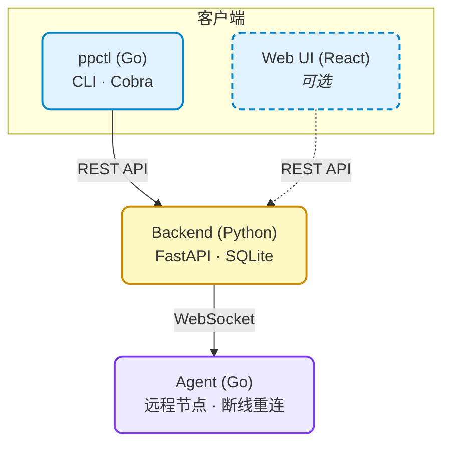
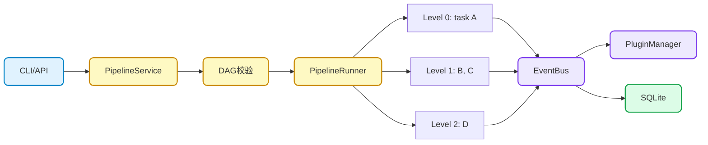
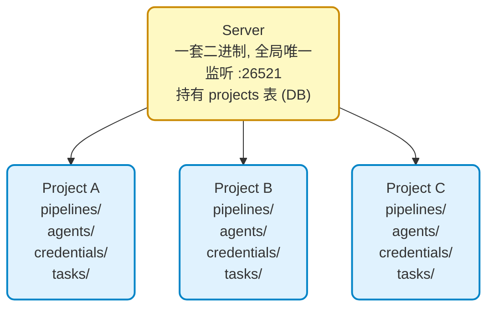

# Taskpps

<p>
  
  
  
  
</p>

轻量级、可扩展的任务编排系统，替代 Jenkins 等重量级 CI/CD 工具，适合中小团队和项目。

## 特性

- **YAML 即配置** — 全局默认值 + 任务级覆盖，零模板
- **三种任务类型** — Shell 命令 / SSH 远程 / Python invoke
- **Agent 远程执行** — WebSocket 节点，断线自动重连
- **DAG 依赖编排** — 拓扑排序、并发、失败策略（fail / continue）
- **可观测** — SSE 实时日志、运行历史、状态跟踪
- **插件化** — 触发器（Cron）、通知器、执行器均可扩展
- **API 密钥认证** — 可选中间件保护
- **国际化** — 内建中文 / English
- **Code / Project 解耦** — 一套 Server 同时管理多个项目，每个项目独立的 pipelines/agents/credentials

## 架构设计



### 数据流程



### 多项目架构



## 快速开始

```bash
# 后端
cd server && uv sync && uv run taskpps-server

# CLI（另一终端）
cd cli && go build -o bin/ppsctl .

# 进入项目目录，注册并初始化
cd /path/to/your/project
ppsctl init --register-current-folder
ppsctl run deploy.yaml TAG=latest

# Web UI（可选）
cd web && npm install && npm run dev

# 远程 Agent（可选）
cd execution_agent && go build -o bin/taskpps-agent .
./bin/taskpps-agent --server ws://localhost:26521 --agent-id node1
```

## 详细文档

| 模块 | 文档 |
|:--|:--|
| 快速开始 | `wiki/Quick-Start.md` |
| 架构设计 | `wiki/Architecture.md` / `server/docs/arch.md` |
| 流水线配置 | `wiki/Pipeline-Configuration.md` / `server/docs/pipeline.md` |
| 任务类型 | `wiki/Task-Types.md` / `server/docs/tasks.md` |
| 执行器 | `wiki/Executors.md` / `server/docs/executors.md` |
| Agent 节点 | `wiki/Agent.md` |
| 插件系统 | `wiki/Plugin-System.md` |
| 触发器 | `wiki/Triggers.md` / `server/docs/triggers.md` |
| API 参考 | `wiki/API-Reference.md` / `server/docs/api.md` |
| 部署 | `wiki/Deployment.md` |
| 开发指南 | `wiki/Development.md` / `server/docs/development.md` |
| CLI 概述 | `wiki/CLI-Overview.md` / `cli/docs/overview.md` |
| CLI 命令 | `wiki/CLI-Commands.md` / `cli/docs/commands.md` |
| CLI 配置 | `wiki/CLI-Configuration.md` / `cli/docs/config.md` |

## 开发

```bash
# 后端 — 测试 + 覆盖率
cd server && uv sync --dev
uv run pytest tests/ -v
uv run pytest tests/ --cov=taskpps --cov-report=term-missing

# CLI
cd cli && go build -o bin/ppsctl .

# Agent
cd execution_agent && go test ./... -v

# Web
cd web && npm install && npm run dev
```

## 项目结构

```
taskpps/                  # 代码仓库（server / cli / agent / web）
├── cli/                  # Go CLI (ppsctl) — Cobra
├── server/               # Python 后端 — FastAPI + SQLModel + aiosqlite
│   ├── taskpps/          #   核心包
│   └── tests/            #   测试
├── web/                  # React + TypeScript 前端页面
├── execution_agent/      # Go 远程执行节点 — WebSocket
├── wiki/                 # 文档
└── examples/             # 示例

# 项目数据（每个项目独立，可放在任意位置）
my-project/
├── pipelines/            # 流水线定义 (YAML)
├── agents/               # Agent SSH 主机配置 (YAML)
├── credentials/          # SSH 凭据 (YAML)
├── tasks/                # 任务仓库
└── plugins/              # 用户插件
```

用 `ppsctl init --register-current-folder` 把项目目录注册到 server，server 端通过 `project_id` 路由。

## 许可证

[MIT](LICENSE)