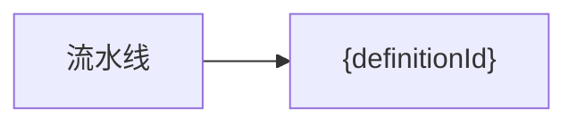
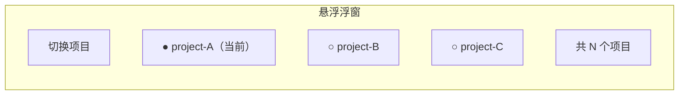
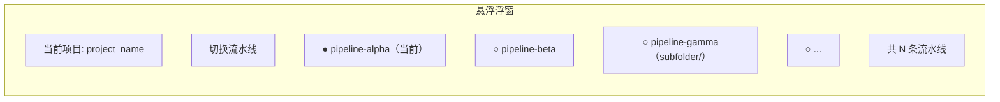
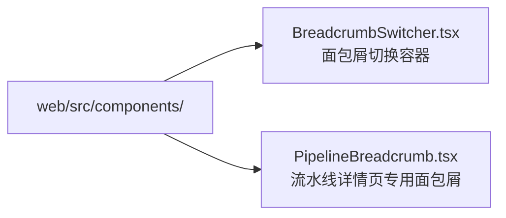
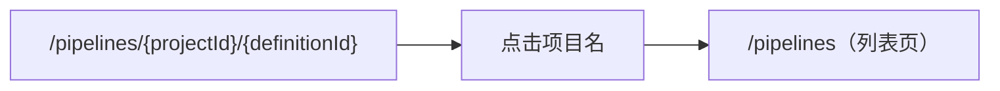
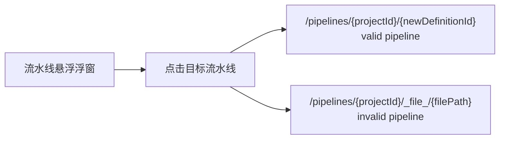

# 面包屑优化：显示项目名/流水线名 + 悬浮切换

## 1. 背景

当前流水线详情页面包屑为：



例如 `/pipelines/0b888955f4c9/e738c2ee68bd` 显示的是原始 ID，对用户不友好。用户希望看到**项目名称 / 流水线名称**，并能通过悬浮浮窗快速切换项目和流水线。

## 2. 涉及页面

| 页面 | 路由 | 当前面包屑 |
|------|------|-----------|
| 流水线详情 | `/pipelines/:projectId/:definitionId` | `流水线 > {definitionId}` |
| 流水线详情(文件模式) | `/pipelines/:projectId/_file_/*` | `流水线 > {filePath}` |
| 运行详情 (可选) | `/runs/:id` | `运行历史 > {run.display_name}` |

**本期仅覆盖流水线详情页。** 运行详情页可后续跟进。

## 3. 功能需求

### 3.1 面包屑展示名称

**当前** → **目标**

| 占位 | 当前显示 | 目标显示 |
|------|---------|---------|
| 项目 | `0b888955f4c9` (UUID) | `project_name` |
| 流水线 | `e738c2ee68bd` (definition_id) / `path/to/file.yaml` | `pipeline.name` (YAML 中定义的 name) |

目标面包屑：

```
流水线 > {project_name}  /  {pipeline_name}
```

- `{project_name}` 可点击跳转到 `/pipelines` 列表
- `{pipeline_name}` 无点击跳转（当前页即为该流水线）

### 3.2 悬浮切换浮窗

#### 3.2.1 项目悬浮切换

鼠标悬浮在面包屑的 `{project_name}` 上时，弹出小浮窗：



- 浮窗列出所有已注册项目（数据源：`GET /api/projects/`）
- 当前项目显示选中态
- 点击其他项目 → 跳转到 `/pipelines/{newProjectId}`（即该项目流水线列表页）
- 点击外部 / 移出浮窗 → 关闭

#### 3.2.2 流水线悬浮切换

鼠标悬浮在面包屑的 `{pipeline_name}` 上时，弹出小浮窗：



- 浮窗列出当前项目下所有流水线（数据源：`GET /api/pipelines/?project_id={currentProjectId}`）
- 按 folder 分组展示（缩进或前缀）
- 当前流水线显示选中态
- 点击其他流水线 → 跳转到 `/pipelines/{currentProjectId}/{newDefinitionId}`
- 非法流水线（`valid: false`）跳转到 `/pipelines/{currentProjectId}/_file_/{filePath}`
- 点击外部 / 移出浮窗 → 关闭

### 3.3 首次加载状态

- 页面加载时，项目名和流水线名优先用已有数据渲染
- 如果当前页面没有携带 project_name，通过 `GET /api/projects/{projectId}` 补全
- 数据到达前显示骨架屏/短占位符而非空白

## 4. 技术方案

### 4.1 数据获取

当前 PipelineDetailPage 已持有的数据：

| 数据 | 来源 | 已获取 |
|------|------|--------|
| `projectId` | `useParams` | ✅ URL 参数 |
| `definitionId` | `useParams` | ✅ URL 参数 |
| `pipeline.name` | `usePipelineById(definitionId)` | ✅ 已获取，但未用于面包屑 |
| project_name | 目前页面未获取 | ❌ 需要新增 |

新增数据获取：

```typescript
// 获取项目名称
const { data: project } = useQuery({
  queryKey: ['project', projectId],
  queryFn: () => apiClient.get(`/api/projects/${projectId}`),
  enabled: !!projectId,
});

// 获取项目列表（用于悬浮切换浮窗）
const { data: projects } = useProjects();

// 获取当前项目所有流水线（用于悬浮切换浮窗）
const { data: projectPipelines } = usePipelines({ project_id: projectId });
```

### 4.2 组件设计

建议创建两个组件：



**`BreadcrumbSwitcher.tsx`** 设计：

- 通用悬浮切换组件，接收 `items` 数组
- 每个 item 支持：
  - `label: string` — 显示文本
  - `options: { key: string; label: string }[]` — 切换选项列表
  - `currentKey: string` — 当前选中项
  - `onSwitch: (key: string) => void` — 切换回调

```typescript
interface BreadcrumbSwitchItem {
  label: string;
  popoverContent: React.ReactNode;  // 自定义浮窗内容
}

interface BreadcrumbSwitcherProps {
  items: BreadcrumbSwitchItem[];
}
```

**`PipelineBreadcrumb.tsx`** 设计：

```typescript
interface PipelineBreadcrumbProps {
  projectId: string;
  projectName?: string;      // 优先使用已有数据
  definitionId?: string;
  pipelineName?: string;      // 优先使用已有数据
  isFileMode: boolean;
  filePath?: string;
}
```

### 4.3 路由跳转逻辑

项目切换：



**建议行为：** 跳转到 `/pipelines` 列表页，让用户看到该项目的所有流水线。

流水线切换：



### 4.4 现有代码改动范围

**`PipelineDetailPage.tsx`** — 面包屑区域（第 238-245 行）：

```tsx
{/* 修改前 */}
<Breadcrumb
  items={[
    { title: <a onClick={() => navigate('/pipelines')}>流水线</a> },
    { title: isFileMode ? actualFilePath : definitionId },
  ]}
/>

{/* 修改后 */}
<PipelineBreadcrumb
  projectId={projectId}
  projectName={projectName}
  definitionId={definitionId}
  pipelineName={pipeline?.name}
  isFileMode={isFileMode}
  filePath={actualFilePath}
/>
```

**无需改动：** 后端 API 无变动（前端仅消费现有接口）。

### 4.5 样式与交互细节

| 状态 | 行为 |
|------|------|
| 悬浮 | 文字加下划线 / 背景色微变 + 鼠标变为 pointer |
| 浮窗弹出 | 150ms 淡入，点击外部或 Esc 关闭 |
| 浮窗最大高度 | 320px，超出滚动 |
| 搜索 | 浮窗内项目/流水线列表支持即时搜索过滤 |
| 选中态 | 左侧蓝点/高亮背景 |

## 5. 验收标准

1. **面包屑展示正确名称：** 打开 `/pipelines/0b888955f4c9/e738c2ee68bd`，面包屑显示 `流水线 > {project_name} / {pipeline_name}` 而非 UUID
2. **项目悬浮切换：** 悬浮项目名弹出浮窗，列出的项目与 `GET /api/projects/` 一致，点击后跳转到 `/pipelines`
3. **流水线悬浮切换：** 悬浮流水线名弹出浮窗，列出当前项目所有流水线，点击后跳转到对应流水线详情页
4. **文件模式兼容：** `/pipelines/{projectId}/_file_/path/to/file.yaml` 也正确显示项目名，流水线名显示文件名
5. **加载态：** 页面加载时面包屑不闪白，显示合理的占位符或骨架
6. **边缘情况：**
   - 项目只有一个时，浮窗仍可弹出
   - 流水线名称过长时浮窗内截断显示
   - 切换到一个不存在的流水线 → 显示 404 提示

## 6. 不做的事（明确的 out of scope）

- 不改动后端 API（当前接口已足够）
- 不改动运行详情页面包屑（留待后续）
- 不改动流水线列表页面包屑（列表页无面包屑）
- 不添加全局 breadcrumb context / provider（保持轻量）
- 不做面包屑的"返回上一级"功能（已有浏览器回退）
